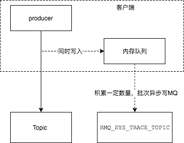

## RocketMQ 消息轨迹设计
- 如何启动消息轨迹

`public DefaultMQProducer(final String producerGroup, boolean enableMsgTrace, final String customizedTraceTopic)`

`public DefaultMQProducer(final String producerGroup, boolean enableMsgTrace)`

`public DefaultMQProducer(final String producerGroup, RPCHook rpcHook, boolean enableMsgTrace,final String customizedTraceTopic)`

启动消息轨迹可通过上述三个构造方法启动

enableMsgTrace：为true时，表示已经开启消息轨迹功能，false时则未开启消息轨迹

customizedTraceTopic：自定义存放消息轨迹信息的Topic名称。默认情况下为`RMQ_SYS_TRACE_TOPIC`，该Topic下存放的为消息轨迹的信息

- 消息轨迹整体流程

send message时消息轨迹的处理过程：

- 消息轨迹消息结构

- 消息轨迹信息存储位置

- 

